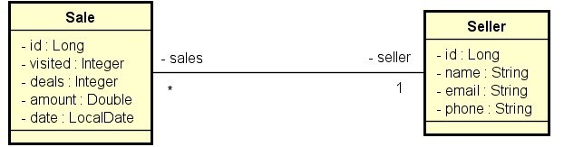

# Back-end Consulta de Vendas

###### E-mail: edilson_brandaojunior@hotmail.com
###### Linkedin: <https://www.linkedin.com/in/juniorbrandao/>

 Projeto de estudo de criação de api, onde uso as seguinte tecnologias:

 [](https://www.oracle.com/java/technologies/javase/jdk17-archive-downloads.html)

 [](https://spring.io/projects/spring-boot)

 [](https://www.jetbrains.com/pt-br/idea//)

 [](https://www.postman.com/)

#### Linguagens

        Java jdk 17 

#### Gerenciamento de projetos

        Maven

#### Frameworks

        Springboot, Spring Data JPA

#### DB

        Em ambiente de testes utilizo o banco de dados H2(em memória),
        e o Postgres em ambiente de desenvolvimento.

### Configurações para inicialização

       Execute o comando: mvn install para instalar as dependências do maven.
       Após baixar as dependências, execute a aplicação e a api estará rodando em http://localhost:8080.
       Acesso ao banco de dados: http://localhost:8080/h2-console.

### Documentação

       A documentação da api foi gerada através do Swagger e pode ser acessada em http://localhost:8080/swagger-ui.html#

### repositório: <https://github.com/junior-brandao/e-commerce>

### 1- Visão geral do sistema

  Trata-se de um sistema de vendas(Sale) e vendedores(Seller). Cada venda está
  para um vendedor, e um vendedor pode ter várias vendas.

## 2 - Modelo Conceitual



## Tecnologias

##### Principais ferramentas

- [Aplicação_web] - Spring WEB
- [Persistência] -Spring Data JPA
- [Database] - Spring Boot With H2 Database
- [Dependências] - Spring Boot Maven
- [IDE] - IntelliJ
- [API] - Postman

```

```

[//]: # (These are reference links used in the body of this note and get stripped out when the markdown processor does its job. There is no need to format nicely because it shouldn't be seen. Thanks SO - http://stackoverflow.com/questions/4823468/store-comments-in-markdown-syntax)

   [Aplicação_web]: <https://docs.spring.io/spring-boot/docs/current/reference/html/web.html#web.servlet>
   [Persistência]: <https://spring.io/projects/spring-data-jpa>
   [Database]: <https://www.baeldung.com/spring-boot-h2-database/>
   [Dependências]: <https://docs.spring.io/spring-boot/docs/current/maven-plugin/reference/htmlsingle/>
   [IDE]: <https://www.jetbrains.com/pt-br/idea//>
   [API]: <https://www.postman.com/>
